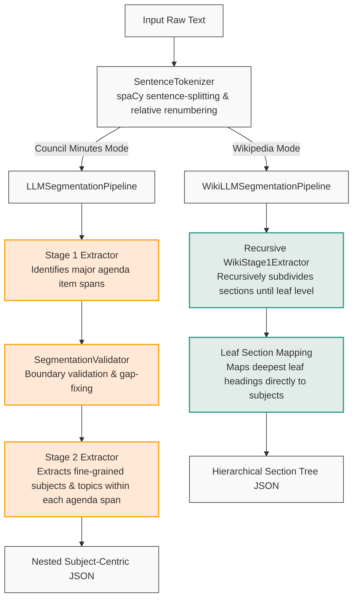

# HSeg: A Two-Stage Hierarchical Text Segmentation Framework

[](LICENSE)
[](https://www.python.org/downloads/)

HSeg is a robust and flexible Large Language Model (LLM) based text segmentation framework designed to automatically partition unstructured documents into logically coherent, hierarchical sections. Utilizing **sentence-ID grounding**, HSeg constrains LLMs to reference actual sentence indices from the source text, eliminating hallucinations and ensuring high-precision boundary alignment.

The framework supports two distinct operational modes:
1. **Two-Stage Council Minutes Mode**: Optimized for administrative documents (e.g., Portuguese city council meeting minutes). Stage 1 extracts top-level agenda items, and Stage 2 identifies fine-grained subjects and classifies topics within each item.
2. **Recursive Wikipedia Mode**: Optimized for deeply nested documents (e.g., Wiki-727k). Stage 1 runs recursively to discover heading structures at arbitrary depths (lead/preface, major sections, subsections, sub-subsections) and maps leaf sections directly to subject segments.

---

## Architecture

HSeg dynamically adapts its pipeline depending on the structure of the input dataset:



---

## Directory Structure

All core framework components reside in the `src/` directory:

```
.
├── LICENSE                     # Creative Commons Attribution-NonCommercial-NoDerivatives 4.0
├── README.md                   # This documentation file
├── .gitattributes              # Git attributes configuration
└── src/
    ├── __init__.py                 # Exposes core classes & dataset loaders
    ├── utils/
    │   ├── __init__.py             # Exposes utility classes
    │   ├── preprocessing.py        # spaCy-based tokenizer with custom Portuguese rules
    │   ├── postprocessing.py       # SegmentationValidator with gap-filling & overlap merging
    │   ├── json_correction.py      # Self-correction logic for LLM JSON outputs
    │   └── evaluation.py           # Computes Boundary F1, Pk, WindowDiff, BED
    ├── llm/
    │   ├── __init__.py             # Exposes LLM Interface
    │   └── llm_interface.py        # Unified LLM client (HuggingFace, Gemini, OpenAI, etc.)
    ├── extractors/
    │   ├── __init__.py             # Exposes extractors
    │   ├── stage1_extractor.py     # Coarse/root section extractors (flat & recursive)
    │   └── stage2_extractor.py     # Fine-grained subject extractor using dynamic Pydantic schemas
    ├── pipelines/
    │   ├── __init__.py             # Exposes pipelines
    │   └── pipeline.py             # Orchestrates LLMSegmentationPipeline & WikiLLMSegmentationPipeline
    └── data/
        ├── __init__.py             # Exposes dataset loaders
        └── data_loader.py          # Data loaders for CitiLink-Minutes and Wiki-727k datasets
```

---

## Installation

### Prerequisites
- Python 3.10+
- A CUDA-capable GPU (recommended for local transformers)

### Install Dependencies
```bash
# Core package dependencies
pip install spacy transformers torch pydantic openai huggingface_hub requests google-genai

# Download spaCy language models (Portuguese lg model and English lg model)
python -m spacy download pt_core_news_lg
python -m spacy download en_core_web_lg

# Optional: Install segeval for advanced segmentation metrics
pip install segeval

# Optional: Install bert-score for semantic theme evaluation
pip install bert-score
```

---

## Usage

### 1. Council Minutes Mode (Two-Stage)
This mode segments meeting transcripts in Portuguese into agenda items and fine-grained subjects, utilizing Gemini, OpenAI, or local models.

```python
from hseg.pipeline import LLMSegmentationPipeline

# Initialize the pipeline
pipeline = LLMSegmentationPipeline(
    backend="gemini",
    model_name="gemini-2.5-flash-lite",
    sentence_model="pt_core_news_lg",
    temperature=0.1
)

# Load document text
with open("minute.txt", "r", encoding="utf-8") as f:
    text = f.read()

# Segment the document
result = pipeline.segment(
    text,
    extract_theme=True,
    extract_topics=True,
    return_metadata=True
)

# Explore results
for item in result["agenda_items"]:
    print(f"\nAgenda Item: {item['item_title']} [{item['start']}-{item['end']} chars]")
    for subject in item["subjects"]:
        print(f"  - Subject Theme: {subject['theme']}")
        print(f"    Topics: {subject['topics']}")
        print(f"    Boundaries: {subject['start_id']} to {subject['end_id']}")
```

### 2. Wikipedia Mode (Recursive Tree)
This mode recursively parses Wikipedia articles into deep section trees, mapping leaves directly to subjects.

```python
from hseg.pipeline import WikiLLMSegmentationPipeline

# Initialize the Wikipedia pipeline
pipeline = WikiLLMSegmentationPipeline(
    backend="local_transformers",
    model_name="meta-llama/Llama-3.1-8B-Instruct",
    sentence_model="en_core_web_lg",
    max_depth=5,
    min_sentences_to_subdivide=3
)

with open("wiki_article.txt", "r", encoding="utf-8") as f:
    text = f.read()

result = pipeline.segment(text, return_metadata=True)

# Access top-level items and hierarchical leaves
for item in result["agenda_items"]:
    print(f"\nSection: {item['item_title']}")
    print(f"  Leaf Subjects: {len(item['subjects'])}")
```

---

## Datasets

HSeg was benchmarked and evaluated on the following datasets:
- **CitiLink-Minutes Dataset**: A bilingual (Portuguese/English) subject-centric dataset containing annotated municipal council meeting minutes from Portuguese municipalities. Available via [DOI: 10.25747/7KG6-1K22](https://doi.org/10.25747/7KG6-1K22) and exploreable at [Dataset Explorer](https://dataset.citilink.inesctec.pt).
- **Wiki-727k / Wiki-50 Dataset**: A standard Wikipedia document segmentation dataset structured with heading depth markers. Available via [Wiki-727k](https://github.com/koomri/text-segmentation).

---

## Citation

If you use HSeg in your research or reference it in your work, please cite the dissertation:

```bibtex
@mastersthesis{isidrothesis2026,
  author       = {José Miguel Isidro},
  title        = {Text Segmentation of City Council Minutes in European Portuguese},
  school       = {University of Porto},
  year         = {2026}
}
```

---

## License

This repository is licensed under the Creative Commons Attribution-NonCommercial-NoDerivatives 4.0 International License. See the [LICENSE](LICENSE) file for details.